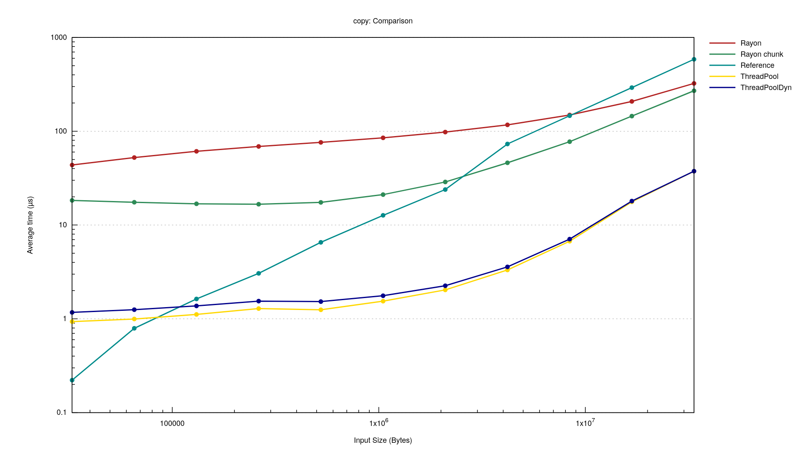

木綿(momen) is low overhead thread pool library.
木綿(momen) means cotton in Japanese.

# Usage

```rust
use momen::prelude::*;
fn daxpy(alpha: f64, x: &[f64], y: &mut [f64]) {
    y.iter_mut().zip(x.iter()).for_each(|(y, x)| *y += alpha * *x);
}
let thread_pool = ThreadPoolDyn::new();
let n = thread_pool.max_len();
let mut x = Vec::with_capacity(1000);
let mut y = vec![0f64; 1000];
for i in 0..1000 {
    x.push(i as f64);
}
let chunck_size = (1000 + n - 1) / n;
let alpha = std::f64::consts::PI;
x.chunks(chunck_size)
 .zip(y.chunks_mut(chunck_size))
 .par_for_each_dyn(&|(x, y)| daxpy(alpha, x, y), &thread_pool);
for i in 0..1000 {
    assert_eq!(alpha * x[i], y[i]);
}
```

# Benchmark


* OS : Ubuntu
* CPU : Ryzen 9 5950X
* MEM : DDR4 3600MHz 128GB
* momen = "0.1.0"
* rayon = "1.5.3"
